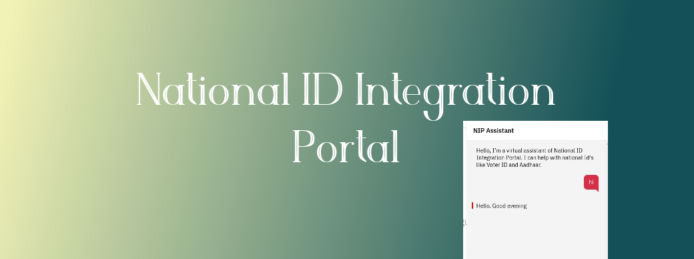

# National ID Integration Portal

[NIP](https://tushar-i2020.github.io/nip/)

- National ID Integration Portal is an application that is fulfilled with SDU [Smart Doc. Understanding] feature. This feature is an ability to understand relevant information of documents and learn from annotation or past experiences that processed through Watson Discovery an IBM Cloud Service. In the end, it forms as a  bot / virtual assistant that helps into customer services by its trained knowledge that has driven from different learning paths (Watson Assistant, Cloud Functions). 

- Bots are a new technological approach that frames a new conversational world. The newest invention connects a world like well-connected threads. Here Bots has a lot to contribute because it’s conversational behavior that helps every service provider. Service is the most important part of service-based firms. Infect, In populous countries, service is the biggest issue because service needs some basic necessities and resources as well as people and time.  
- Bots can help as a better service-man or virtual assistant that helps the number of customers who can’t connect to firms due to lack of communication between company and customer. So, Bots are very intelligent and best learners to understand or gather the relevant information on the specific scenarios. For eg: Giving Appointments, Office locations, or Provide info of Product.

## PROPOSED METHODOLOGY
Our Idea is to respond to this problem by the National ID integration portal that helps every citizen to access the customer services of their relevant Identity queries. NIP Assistant is a bot that learns about ID's and the several details to help people. Users can ask the question to a bot like Queries about aadhaar. Future Scope: It will also help to access the direct details from Govt. official data and also provide other direct, indirect services.
To make the bots up to the merits of customer service, we have to add more features by bots learning grows up and they learn from its experiences. This is possible through IBM Watson Services. Watson Service is of many types in that Discovery is service that helps to learn and provide a smart understanding to target systems like bots.

IBM Watson Discovery process structured, semi-structured and unstructured data to do Watson training on targeted documents. Natural Language Processing makes this happens with different supported formats by Watson Discovery. To improve the trained model we have to do some more efforts like annotate the document with some useful levels. 

## SPECIFICATIONS
### General Specification
It is a conversational cloud-based chatbot for provide serving in respect of National ID. It based on communication robots based on communication trees and NLP models.
Bot services connected to specific communication channels.
An instance of chatbots delivers the messages by their NLP trees.
NLP model takes an incoming message and returns the information on the decision of intents. For eg:

### Infrastructure
The IBM Cloud is used to run the entire solution, Design, and chatbot also its backend is separate groups that working separately. The Backend of Chatbot is designed on the Node.js and the webhook link is used to integrate the actual decision features to the chatbot. Assistant can develop their own knowledge base via fetch the relevant details as a schedule of 1 week’s time. This virtual assistant updated its memory every 12 Hours to refresh the data linked with the knowledge base.

The Decision and Query have a relation with Intent and entities. When Chatbot train with the intents then that able to understand the user intent and get what the user wants to say??

Intents are the user Inputs that they try to say. Utterances are referred for the bot understanding.
Entities are target value include in user calls. Actions made on the basis of user inputs.
### Used Technologies
 - Python3
 - Node.js
 - JS10
 - IBM Cloud Services
 - Smart Document Understanding Features
 - Github

### Supported Channels
It can be integrated into the following channels:
 - Telegram
 - Slack
 - Private Websites
 - WeChat
 - Facebook Messenger
 - Viber
 - Kik and many more channels can be integrated with that chatbot.

### FLOW CHART

## RESULT
The result of the project is a website named National ID Integration Portal. An Assistant is integrated into a website that is the main glory of this project. Assistant popup by clicking on the left-corner chat icon. 

## ADVANTAGE/ DISADVANTAGE
### Advantages
 - AI-based chatbots can learn from their experience.
 - It can handle multiple customers at the same time that helps firms to control their clients and customers.
 - It reduces the human need so, the company cost decreases.
 - The best advantage is that Chatbots available 24/7.

### Disadvantages
 - Chatbots can’t have previous memory with clients.
 - Sometimes it’s complex for many users.

## APPLICATION
- *Virtual Assistance:* It performs the tasks on the command of the user.
- *Customer Services:* It helps to given general info to customers and also connects with human advisory.
- *Legal:* In the Legal Industry chatbots are very helpful to give law advice.

## CONCLUSION
- A chatbot is need of this time because of time demand. This world has most of the things that are popular for their tech novelty and the consequences of the adventure in the markets. Where half of the world wants to connect with new technologies and have a very void background or they don’t have any prior knowledge. So, to address many people for their solution without need any human workforce chatbot is perfectly fit for there situations. So, This type of application can benefits society and business firms also.

## FUTURE SCOPE
- The Internet of things is the world’s new tech attraction. Bots & Application can be a great combination in the tech industry because of internet connectivity with things and chat’s conversational features. Human is very addressable with this conversational feature. Voice Recognization is very featuring for today’s world cause of an easy way to create a connection between humans and machines. We include web drive to automated accessible sites that can help the user to fetch their requested information on one platform without going through multiple sites.
 - A System that prepared on the basis of common souring and delivery. It kind of fun when data fetch is easy because of the conversational approach. 

## REFERENCES
- https://tushar-i2020.github.io/nip/   *[Website]*
- https://github.com/tushar-i2020/nip  *[GitHUB Repo]*
- https://uidai.gov.in/contact-support/have-any-question/277-faqs.html *[Aadhaar Query]*
- https://ceodelhi.gov.in/Content/FAQ.aspx *[Voter ID FAQ]*

